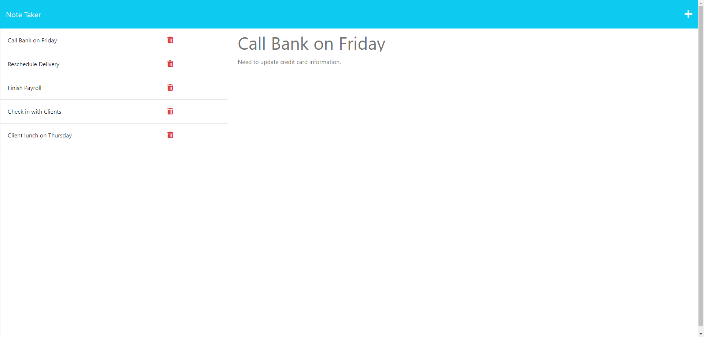

# Mod-11-Note-Taker

## Description

A node.js application that allows a user to write and save notes. It is designed to help the user make a list of notes that they need to track. They can add and delete notes as well as view existing notes. 

## Installation

Project has a dependency on the express library and the user must run npm install to include the needed library.  Additionally, node.js must be installed.

## Usage

Navigate to the following link for to try the deployed application. [Here](https://mod-11-note-taker-production.up.railway.app/)  

The following image shows the application's appearance and functionality:

## Credits

Created from bootcamp front end starter code.  UUID function used from Bootcamp code provided in exercises.  All backend code was done by Nate Tanner.

## License

N/A
